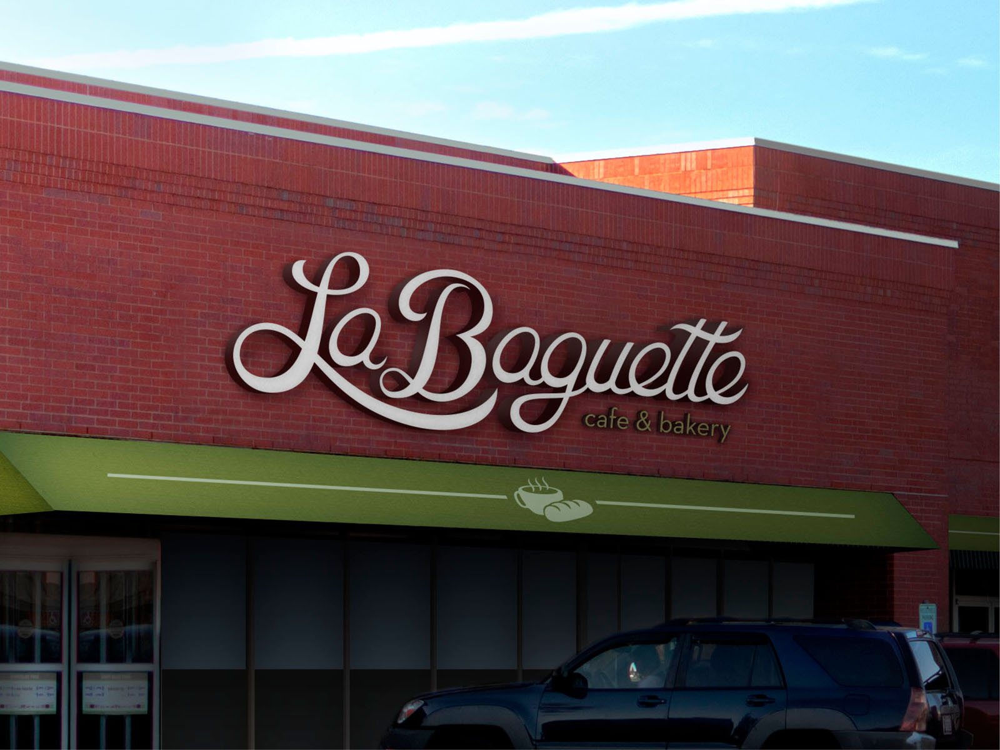
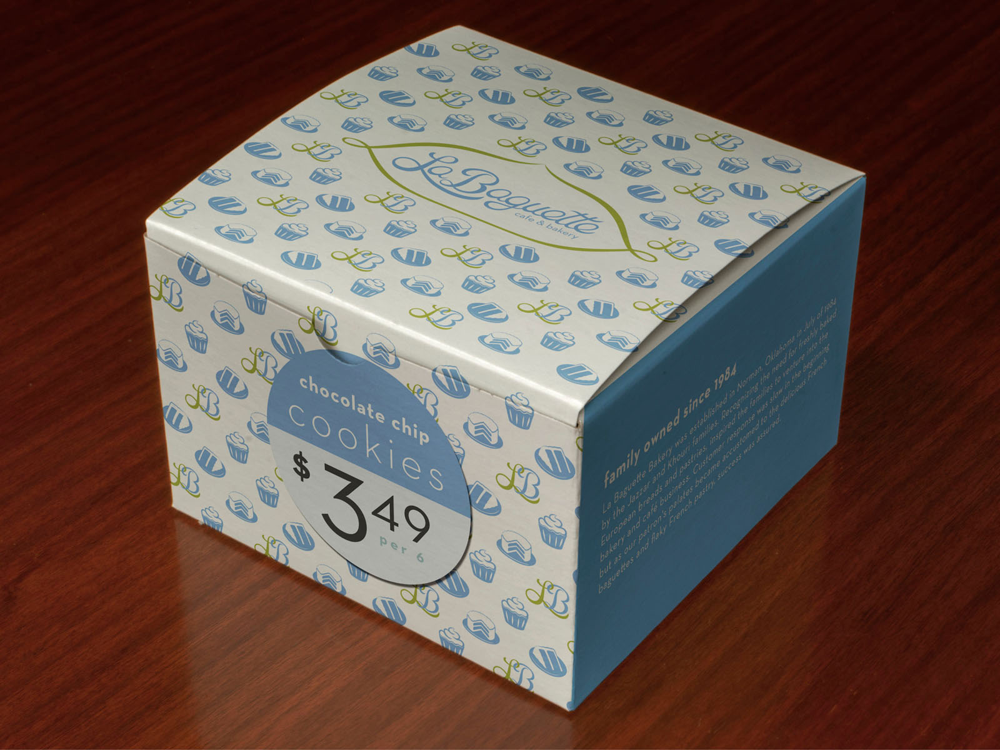
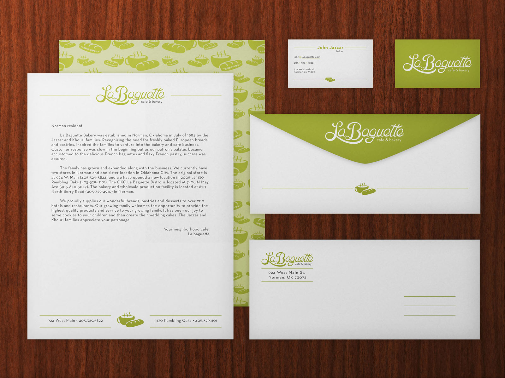

# **LA BAGUETTE** CAFE &amp; BAKERY
#### **Project Type** | Concept Work
La Baguette is a family owned cafe & bakery. In this branding, I used color distinguish the cafe (green) and bakery (blue) sides of the business. The logotype was created using hand lettering and made a set of food symbols based on the staple foods.

<!-- End TenTwentyFour -->
