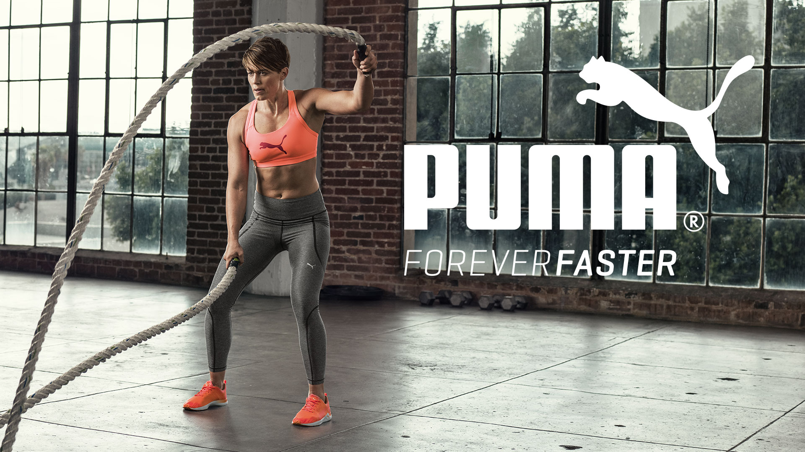
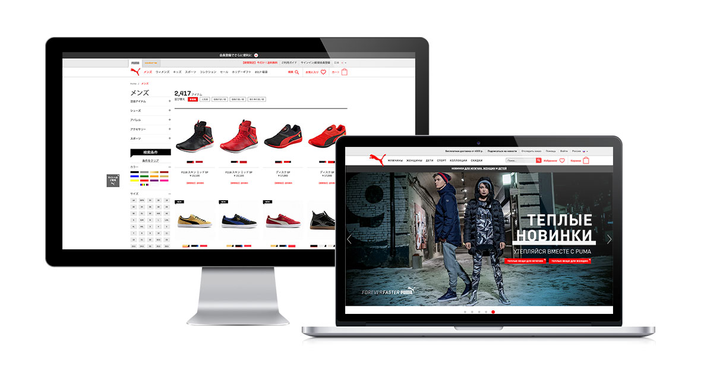
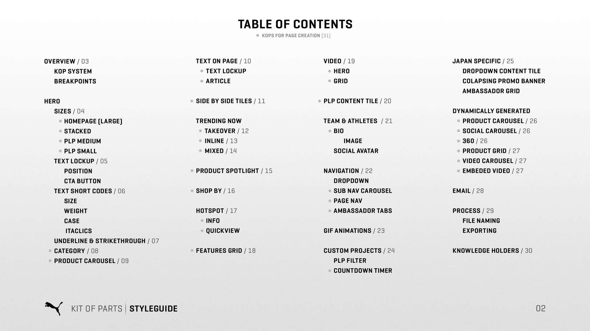
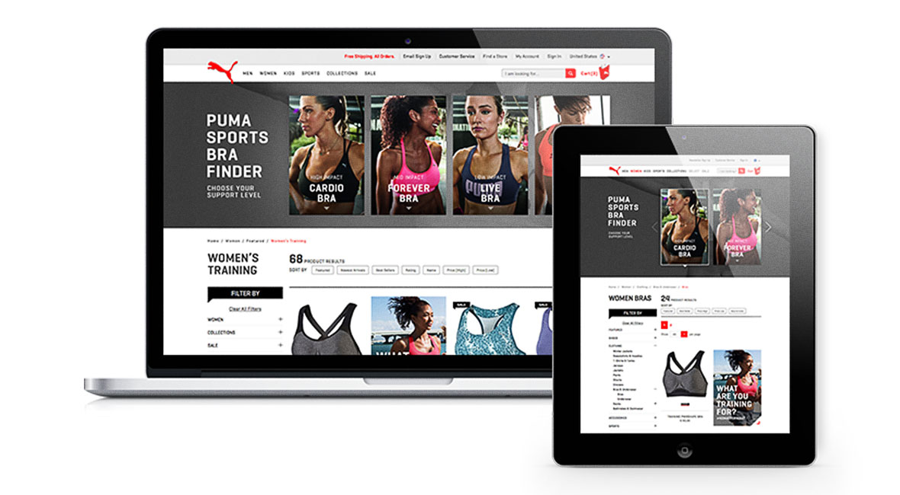
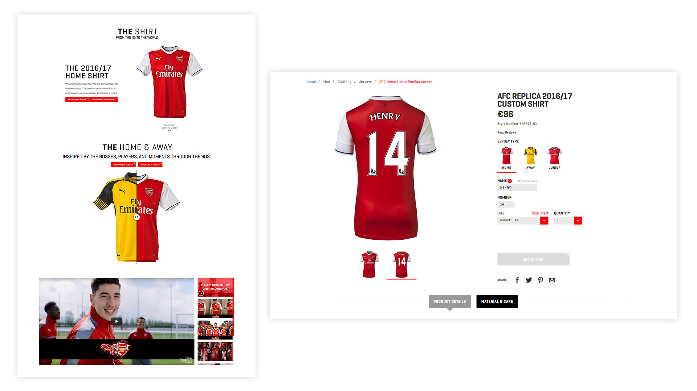
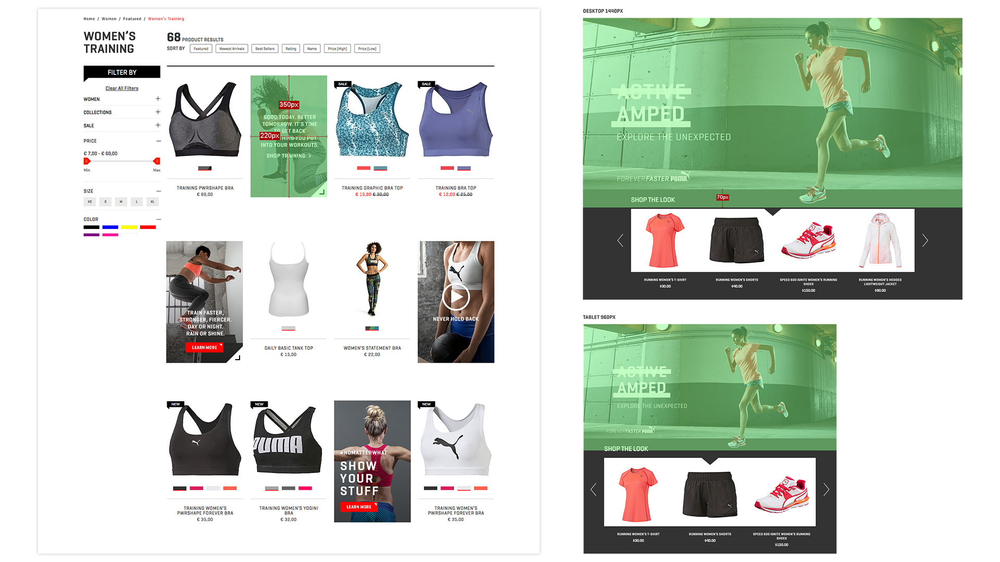
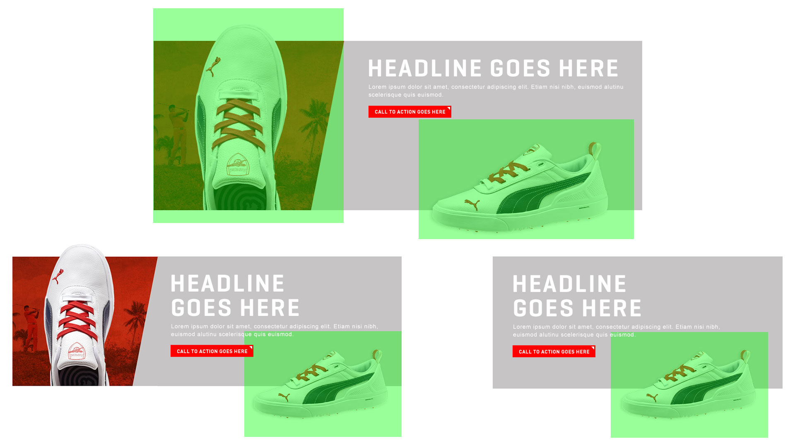
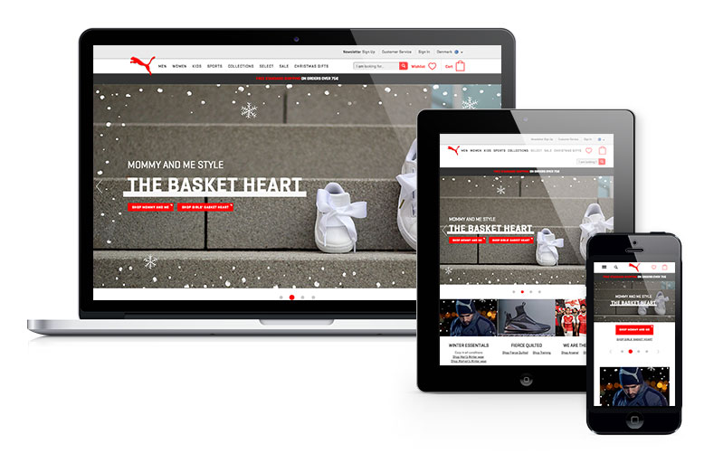
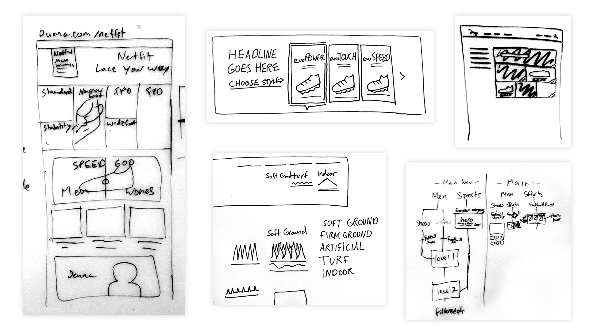

# **PUMA** Global E-Commerce  
#### **Agency** | Fluid
#### **Role** | Lead • Senior Visual and UX
I was fortunate to take lead on the Puma retainer and innovate on a global set of e-commerce sites. Over the course of the project, I helped orchestrate product launches and content production and strategy.

### **Kit of** Parts
To ensure consistency and speed when developing new pages, we used a modular system. The real power of the system was documentation - which allowed us to pick and choose from our kit of parts to craft any experience.

<!-- 

 -->

### **Responsive** Style
We strove not to sacrifice style across breakpoints - while we practiced mobile-first, we gave due diligence across the full spectrum of viewports.

### **Always** Whiteboarding
The team developed a process of always whiteboarding and taking that process further to whiteboarding with our Puma counterparts. The benefit of a long term project is getting to really work hand-in-hand with the clients to develop the fine details of an experience.

<video class="content half" autoplay loop>
  <source src="puma-7.mp4" type="video/mp4">
</video>

### **Video** Prototyping
To take on the challenge of how to present complex ideas to the client and how to fledge out ideas, our team would often have me take our sketches into animation to fledge out the interactions.

<h4 class="txt-center"><b>Team Credits</b> | Tember Hopkins • Pam Tamayo • Jeremy Elliot</h4>

