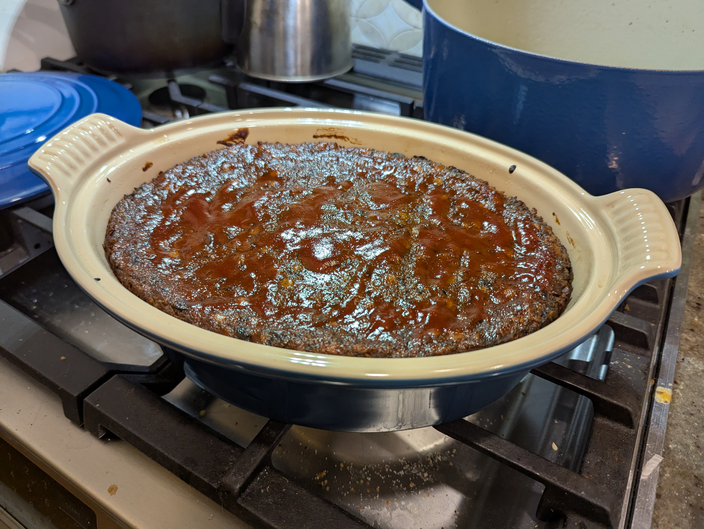

## Directions
### Make the Meatloaf
* Chop 1 white onion and add to dutch oven
* Add 4 tablespoons of olive oil
* Add 1/4 cup of water
* Saute for 5 minutes
* Start choping 16oz of mushrooms while onions are sauteing
* Sauté additional 5 minutes on medium-high heat
* Add 1 teaspoon salt 
* Add 1 tablespoon of minced garlic
* Add 2 tablespoons tomato paste
* Add 2 teaspoons vegtable stock base
* Add 1 cup water
* Add 3/4 cup of lentils and cover
* Cook for 20 minutes stiring every 5 minutes
* Butter casserole dish
* Size aluminum foil for casserole dish
* Trim ends off of green beans
* Preheat the oven to 375º F 
* Turn off stove
* Use emersion blender on 13 / mid speed to pulse entire mixture lightly
* Add 2 tablespoon of egg replacer (Bob's Redmill)
* Add 2 tablespoons soy sauce
* Add 1 tablespoon Worcestershire sauce
* Add a pinch of ground black pepper
* Add a pinch of dried oregano
* Add 1 teaspoon chili powder
* Add 2 tablespoons ketchup
* Add 1 cup fine dry bread crumbs
* Add 1 cup grated Parmigiano-Reggiano cheese
* Mix thoroughly and transfer mixture into casserole dish 
* Cover with aluminum foil
* Bake for 1 hour
* Start heating large pot of water to rapid boil (For green beans)

### Make the Mashed Potatoes and green beans
* Cook for 3 minutes
* Use tongs to transfer green beans into dutch oven
* Rough chop 5 golden potatoes into medium chunks and move to large pot
* Boil potatoes for 20 minutes
* Drain potatoes
* Add 4 tablespoons / half a stick of butter
* Add 2 tablespoons of olive oil
* Add 1/2 teaspoon of salt
* Mash & stir smooth
* Move the mashed potatoes to large red pyrex tupperware
* Mix the glaze together in a small bowl
    * Add 3 tablespoons of ketchup
    * Add 1 tablespoon of maple syrup

### Makin Gravy
* Add 3 tablespoons olive oil to large large and set to medium heat
* Add 1/2 cup of milk (Dairy or alternative at any cream level)
* Add 1/2 cup of veggie broth
* Stir in 1 tablespoon of amino acids (or soy sauce)
* Add a 1/4 teaspoon of salt
* Add a 1/4 teaspoon of garlic powder
* Add a 1/2 teaspoon of onion powder
* generously pepper
* Add 1 tsp GravyMaster®
* Sift in the 1/4 cup flour and cook, stirring frequently, for three minutes to thicken.

### Back to Meatloaf
* Increase the oven temperature to 450º F
* Remove aluminum foil and glaze the meatloaf
* Return to the oven and bake 15 minutes
* Saute beans with 1 tablespoons of butter and a healthy pinch of salt and pepper

### Putting it all together
* Let meatloaf rest for 10 minutes
* Serve with mashed potatoes and gravy overflowing and enjoy!

## Grocery List {#grocerylist}

* ~16oz mushrooms
* 1 white onion
* 2 tablespoons tomato paste
* 1 teaspoons vegtable broth base (Better than Bouillon®)
* 3/4 cup standard lentils
* 2 tablespoon of egg replacer (Bob's Redmill)
* 2 tablespoons soy sauce
* 2 teaspoons Worcestershire sauce
* 4 tablespoons ketchup
* ½ cup fine dry bread crumbs
* 1 cup grated Parmigiano-Reggiano cheese
* Maple syrup
* green beans 
* 5 golden potatoes
* Butter
* GravyMaster®

