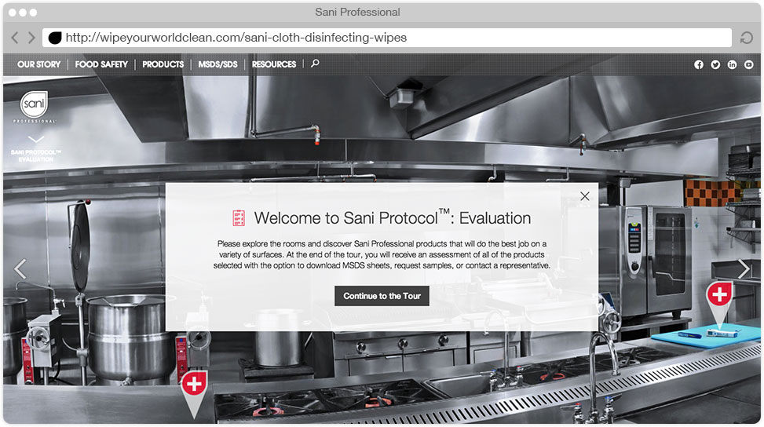
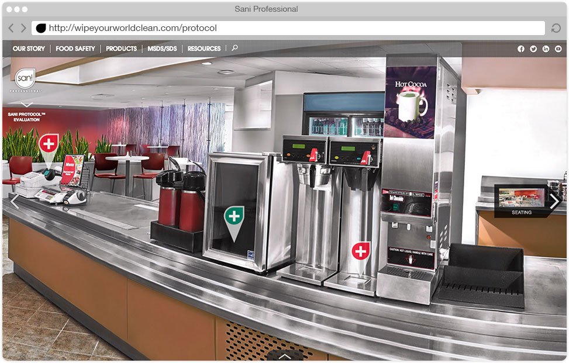
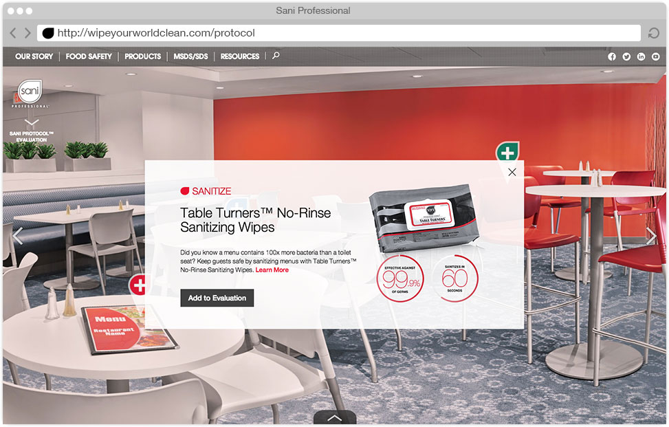
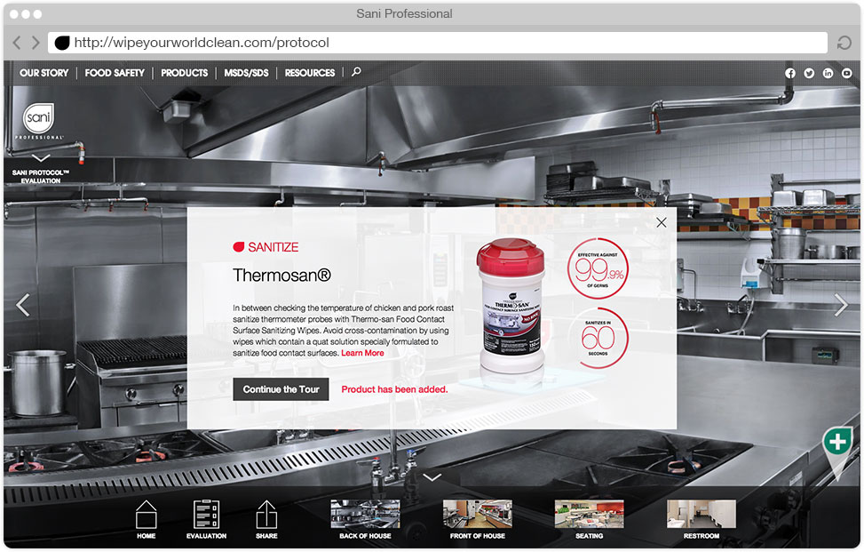
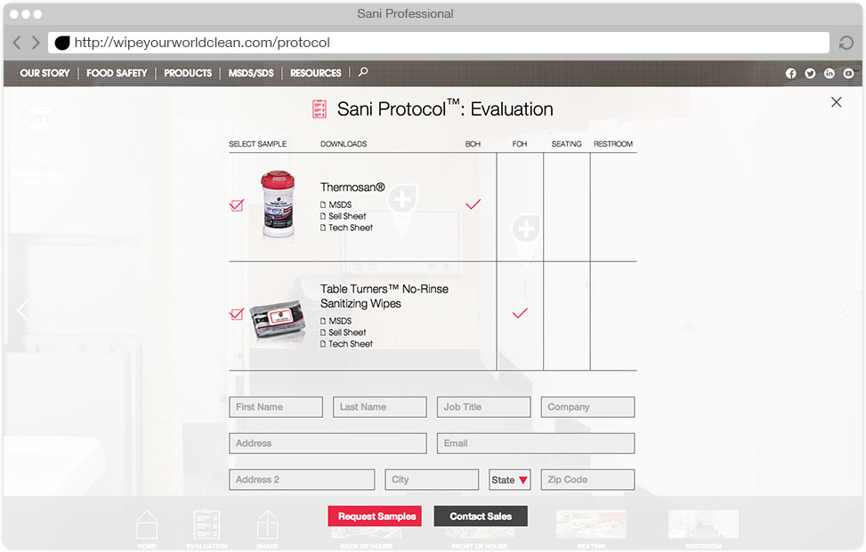

# **Sani** Virtual Product Tour
#### **Agency** | Flightpath
#### **Role** | Lead UI/UX Designer
Sani Professional provides cleaning solutions for the food service industry. We created a virtual tour that helped customers associate products and restaurant surfaces.

I worked with our developers to find the right tool and create a panoramic experience for each space. Customers could navigate between rooms. Photography was highly edited to eliminate distractions in busy environments.

<!-- End TenTwentyFour -->
