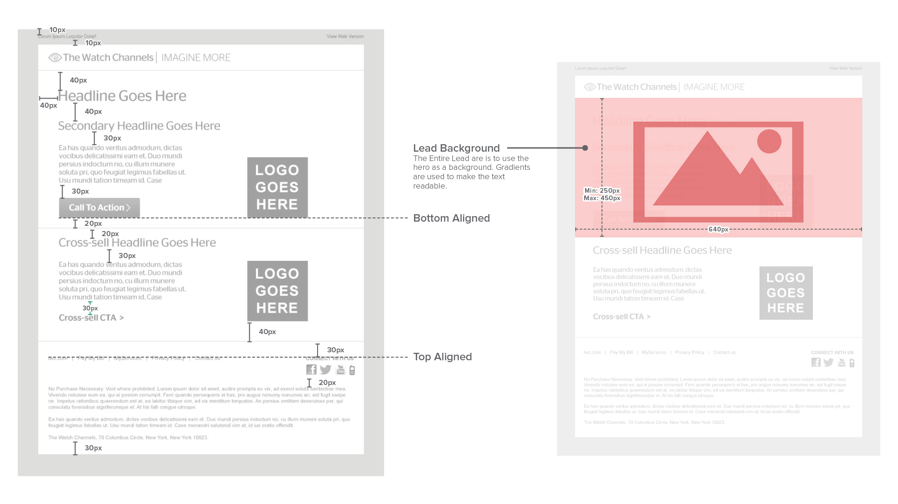
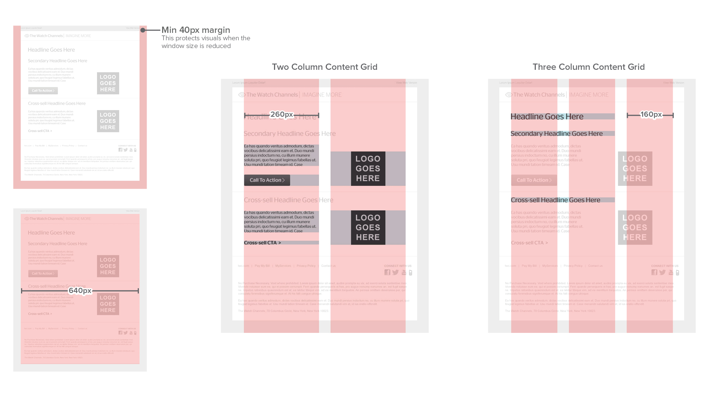
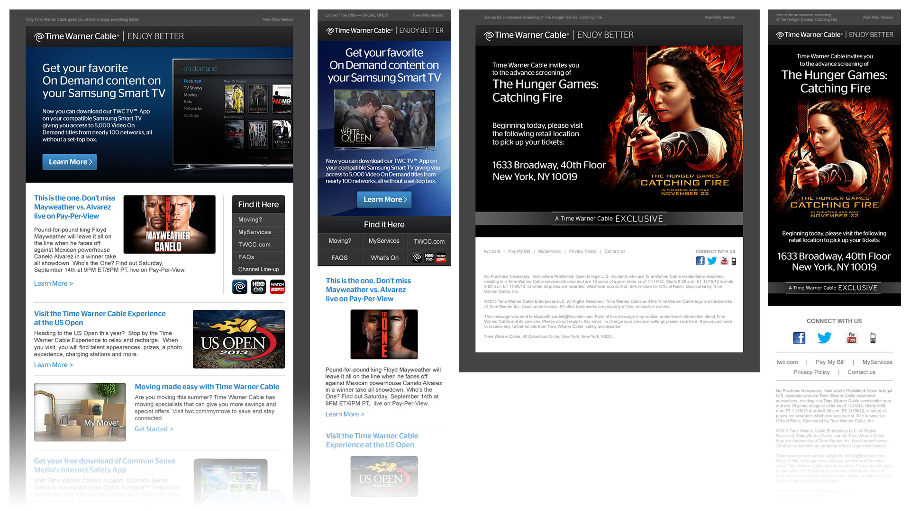
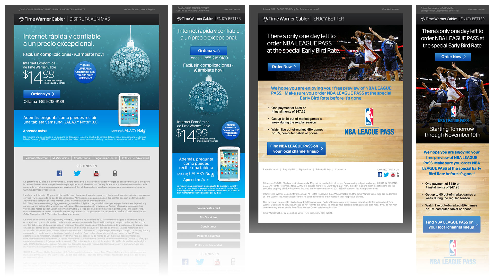
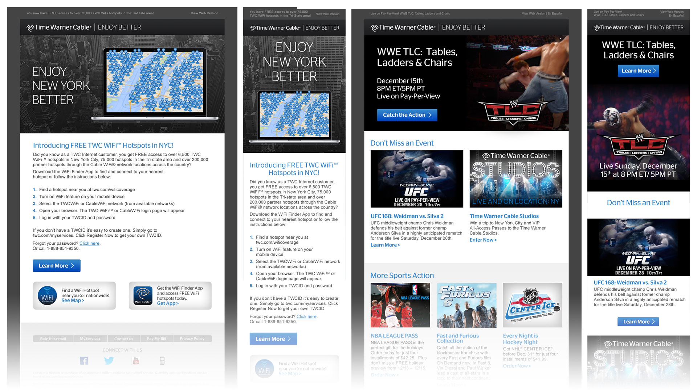

  <h1><b>Time Warner Cable</b> UI/UX</h1>
  <h4><b>Agency</b> | Flightpath</h4>
  <h4><b>Role</b> | Lead • UI/UX Designer</h4>
  
Time Warner Cable (now Spectrum) is the second largest cable company in the United States. I served as lead over the course of my time at Flightpath. We redesigned their entire email system, from account updates to advertising.

### Balancing Efficiency and Variation
With TWC sending hundreds of emails, we utilized standard components for efficiency. We continually switched layouts to keep the communications from becoming stale.

### Email Animation
For special events like WWE matches, we even used animation to spice up the emails. The challenge was keeping download speeds fast with micro-clips.

